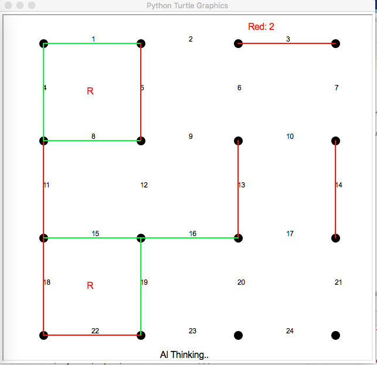

Minimax-algorithm for the game "Dots and Boxes"
-------
This was the second program I wrote on my own. It was during my first AI course at university.  
You play against an AI in a simple board game.  
   
The program is written for python 2.7  
   
There are two versions:
- DBminimax.py
  - This implements the __<a href=https://en.wikipedia.org/wiki/Minimax>minimax-algorithm.</a>__  
    
- DBalfabetaMM.py
  - The AI uses a version of __<a href=https://en.wikipedia.org/wiki/Alpha%E2%80%93beta_pruning>alpha-beta pruning</a>__ in the minimax-search.  
    
    
   
  
   