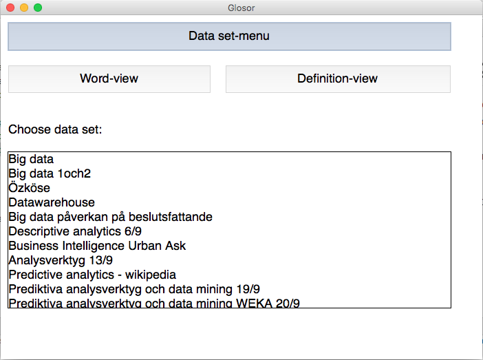
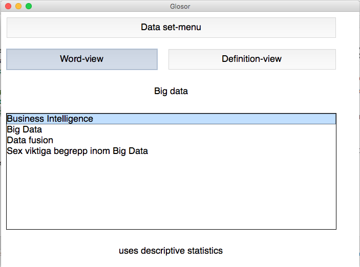
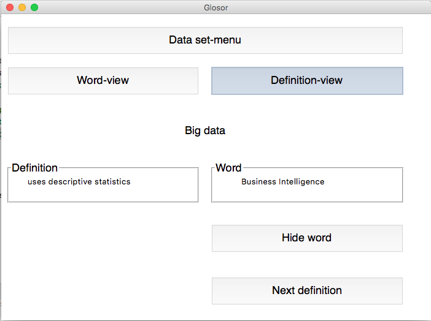

Glossary Program
----
This one I wrote during a course about Big Data at univeristy.  
I had a bunch of notes from classes and wanted to rehearse the material somehow.  
Therefore I tried to build my own flash card program.  
  
  It was the first time I used tkinter for graphical programming and I never totally finnished the project to look super nice. But it works!  
    
  ('Glosor' means glossaries in Swedish) 
  
    
  
    
  
  