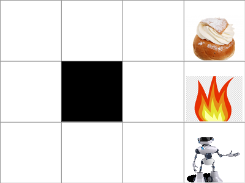

<h1>AI-visualizer in Tkinter</h1>
This is a project I did on the side during an AI-course.

I wanted to visualize different Reinforcement Learning algorithms.
It's not done, but I wrapped it up so it's at least runnable.
But the only two modes are:
   - Value Iteration (Dynamic programming)
   - Free roaming (with keyboard-arrows)

Main dependencies:
- tkinter
- pandas
- numpy
- PIL

