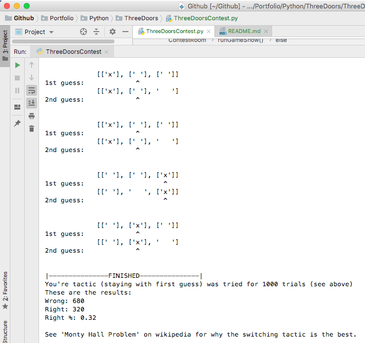

Monty Hall Problem
---
This is a simulation of **<a href=https://en.wikipedia.org/wiki/Monty_Hall_problem>'The Monty Hall Problem'</a>** (by Steve Selvin)

The scenario is that you are presented with three doors:  
[' ']&nbsp;&nbsp;&nbsp;[' ']&nbsp;&nbsp;&nbsp;[' ']      

Behind one of the doors there's a prize:  
['X']&nbsp;&nbsp;&nbsp;[' ']&nbsp;&nbsp;&nbsp;[' ']    
Prize  

But you don't know which door has the prize.  
Then you do your first guess of which door you think has the prize.
Then one of the doors you didn't guess for and which didn't have the prize behind it, is removed.  

Now the question is:  
Do you wanna stay with your first guess or do you want to switch door?  

**If you run the simulation you see that it's better to switch door.**

