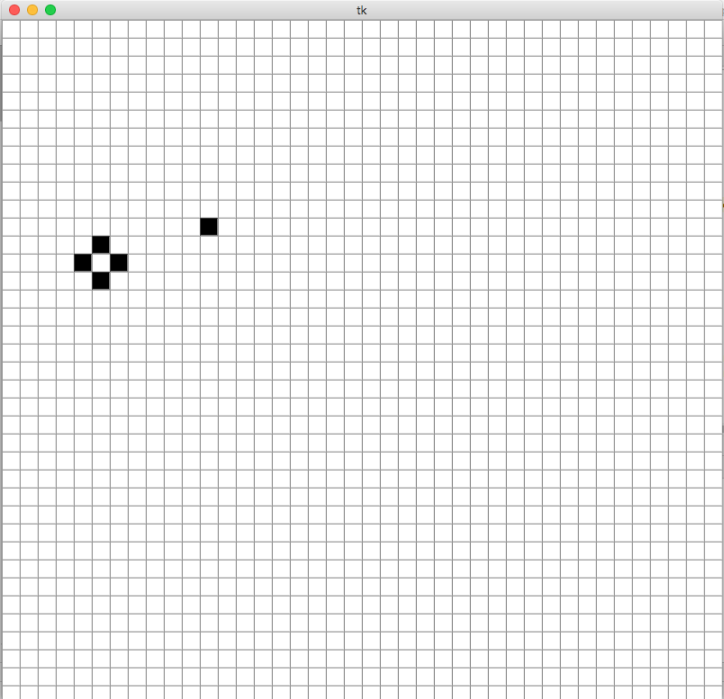
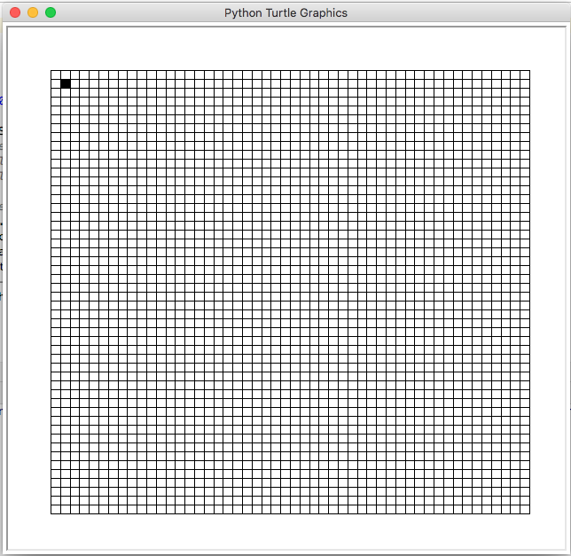
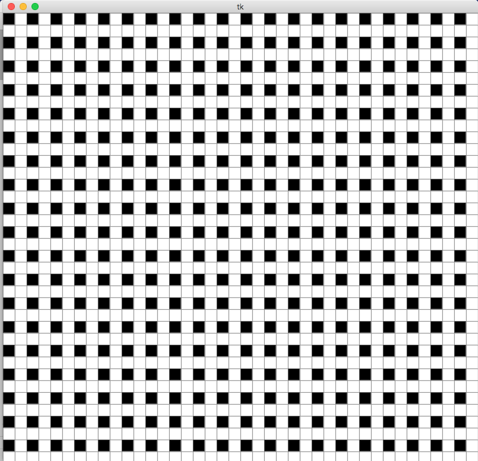

<h4>19th of April</h4>
I've only done small changes lately and I got stuck on how to get something to fall down on the screen. It turned out it was a simple mistake that caused all the trouble.
But now I made it possible for things to fall down from the 'sky' and at the same time you can steer another object with the wasd-keys.     
So now I would like to create a simple game scenario where things happening and you can score points that are being tracked.  

So what I need is:
- A new frame with:
  - A label that keeps track of the score
- A function that makes things fall down randomly from the sky and if you catch them you'll score points  

Besides this I need to think on how to implement this long-term thinking.  
I need to be able to load a specific game into the PixelWorld, so that the pixelworld always is just the frame where things can take place in.  
Also to make it easy for an AI-agent to train in this environment I need to implement all of this structure but on a numpy-array with ones and zeros. But for now it's easier to do it in tkinter to more easy visualize what is happening. And it should be pretty straightforward to just translate the code to working with an numpyarray instead of my own class FrameArray.  

I'll think I continue my bottom-up approach to come out how to implement a game-scenario and then shape up afterwards...  
...Or maybe I'll make a simple top-down plan based on intuitions:  
**The falling down function:**
- Objects randomly showing up at the top of the screen
  - Maybe
- Some way of keeping track of where the objects are
  - I guess a list with PixelObjects that:
    - Get things added to it every time step
    - The Falling-function needs to check if the object has reached the bottom of the screen or the user's collecting object
- A time keeper making them move down

Ok, let's get to it! :)

<h4>2nd of April</h4>
Today I would like to try and make a simple rain animation in the world. Imagine seeing the world as a 2D-game seen from the side. I want objects of a certain shape to fall down from the top of the screen.  
  
In the long run I want several of them to appear randomly. But today I think I'll start by just making one object fall down. 
  
I also would like to be able to save these animations as unique "games" that can be loaded and run. What do I need for this:
- Maybe I could define separate methods outside the class. Put them in separate files, import them and run them with a class method for the class TurtleWorld or PixelWorld.  

I also need to decide wether to continue on PixelWorld or TurtleWorld. In PixelWorld I already have made an animation curently of one pixel that wanders diagonally each time I click the right arrow. Maybe I'll just continue on that.   
  
  So, what I have there is the following structure:  
    
   **PixelWorld (a class)**  
 *Init*  
 It inherits tk.Tk() from tkinter.  
 One head frame is created which contains a lot of small frames, you can see on the screenshot below. 
 
 *Wandering (function)*  
 This function is called when right arrow is pressed, it mswitches the background of a pixel to black and moves it diagonally.
 
 **New loading class**  
 What I need to do is to remake this wandering function. It shoud be callable with keyword args which corresponds to the particular function that is the particular "game" that is going to be shown.
 So it should be callable like PixelWorld.load("falling_cross").
 Yes, load is a good name.  
   
 **How to define falling objects**  
 I also need to define some sort of object, e.g. a cross, and treat this as one object. So maybe a new class should be created called. I think the best is probably to just try to make a simple method within the already existing PixelWorld-class just to get an idea of how to represent an object in this world. And I'll wait with the grandiose plans of *load()*-functions etc.
     
 Ok, so let's get to it then!  
 ...(coding)...
  
So here is the result (each time down arrow is pressed the cross goes down and each time right arrow is pressed the single pixel moves diagonally donw):
 
     
   

<h4>28th of March</h4>
Have kept on trying to implement my solution of a simple pixel map in turtle.  
It has worked out so now I'm able to create this:
  
  
But something I think will be a problem is that it take some time to load. The point of this project is for it to load fast. So when trying to play games in this environment I don't know if it's the right way to implement it.  
Therefore I instead tried to implement it in tkinter, which Turtle is an extension of. This is how that turned out:

But it almost was even slower. (Used frames as pixels). I will continue and see what happens, otherwise it might just be that python and this way of implementing it might not be so good as I hope. 

<h4>25th of March</h4>
<h5>Brainstorming</h5>
Overall idea:
84x84 pixels.
Each shall be painted by a turtle-pointer.
Each pixel can either be: on = black    off = white
  
This is a good start to try to build this. Then after that I will try to figure out how games can be implemented there.
Maybe some sort of interactive aspect might be built in so you could "paint" the pixels and therefore create your objects. Or, when I think about it.. maybe it's enough to define several pixels as one object somehow and then give this object movement-properties somehow. Well, I'll save that for later.
  

What do I need then?

**(TurtleWorld) A class that keeps track of everything**  

Initiation:  
- create the window where the graphics can take place
- create the turtles
- create TurtleArray which keeps track of everything

Functions:
- Something that can convert what happens in the pixel to a corresponding numpy-array with either 1 or 0 so that it easily can be used for training a neural network.
- Something that updates everything in discrete time steps?
- Something that can load games?

**(TurtleArray) A class with modified list that contains the world.**
 The class is a 2x2 array, each spot holding the turtle responsible for each particular pixel. For indexing the turtles  
Needs to receive arguments:  
-Size of array (rows, columns)  
  
  
Functions:
- Inherits list()
- Function that access each turtle

**(PixelTurtle) A class with modified turtle**  
A class with functions that can perform the necessary on- and off-turning of the pixels.  
Needs to receive arguments:  
-size of pixel  
  
Functions:

- Inherits turtle.Turtle()
- _init_ which creates the pixel from the given size
  - Also needs to hide the turtle
- function that fills the pixel/square with color
- function that unfills the pixel
