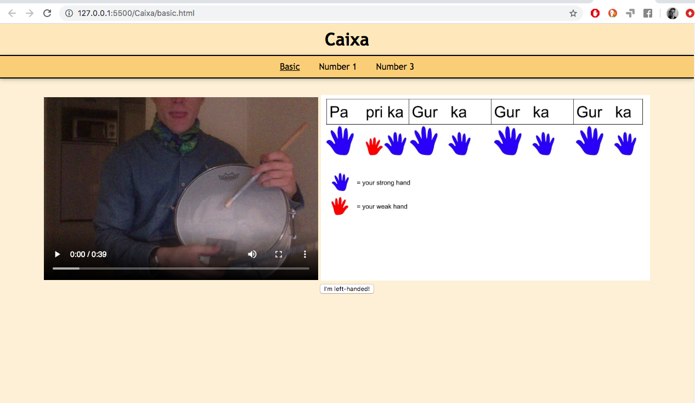
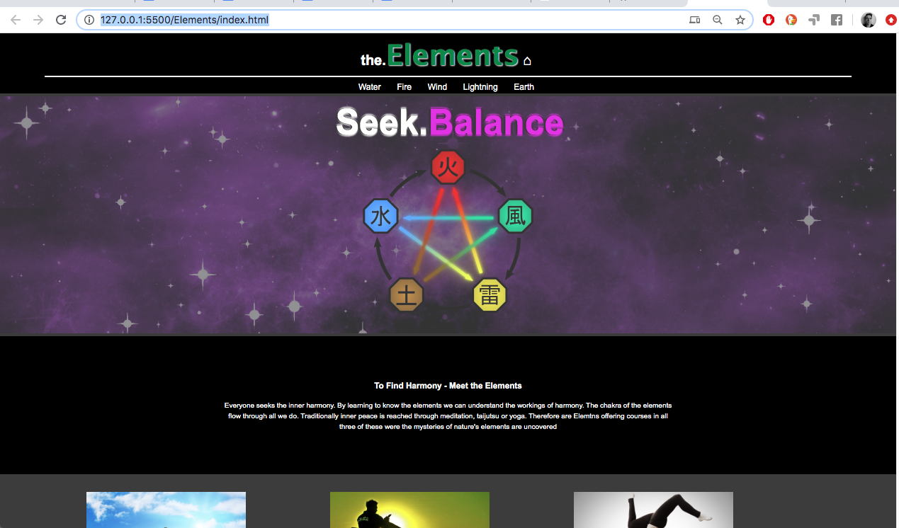

Web Programming
---
I've been playing around some to learn the basics of html/css/javascript.  
  
  This is a page I did in a course: 
  <h3>SocRob</h3>
  Live link: <a href="http://www.student.ltu.se/~loelin-8/Uppgift4a_draft/index.html">SocRob page<a> 
   
  
  
  
  
  
  
  
  
    
  This is two pages I've done for fun:
  
<h3>Samba page (Caixa)</h3>
This one was actually an idea to be used for people I play samba with. A place were they can view how to play at home:
  
  
    
<h3>Wanna-look-cool page (Elements)</h3>
One of the firsts sites I did. I played around to make it look like those modern scrolling pages.  

  
  
 photo credits:  
https://external-content.duckduckgo.com/iu/?u=https%3A%2F%2Fwww.yogajournal.com%2F.image%2Ft_share%2FMTQ2MTgwNzE3MzA1NDA3MDA4%2Falex-crow-handstand.jpg&f=1&nofb=1  
https://thumbs.imagekind.com/5577506_650/Martial-Arts-Man-Silhouette-Katana-Fighter-Stance_art.jpg?v=1493064985  
http://inspirationtravels.com/wp-content/uploads/2016/05/meditating-pose-blue.jpg  
http://vignette3.wikia.nocookie.net/narutofanon/images/c/c8/Rinne_Godai.png/revision/latest?cb=20140827184708  

